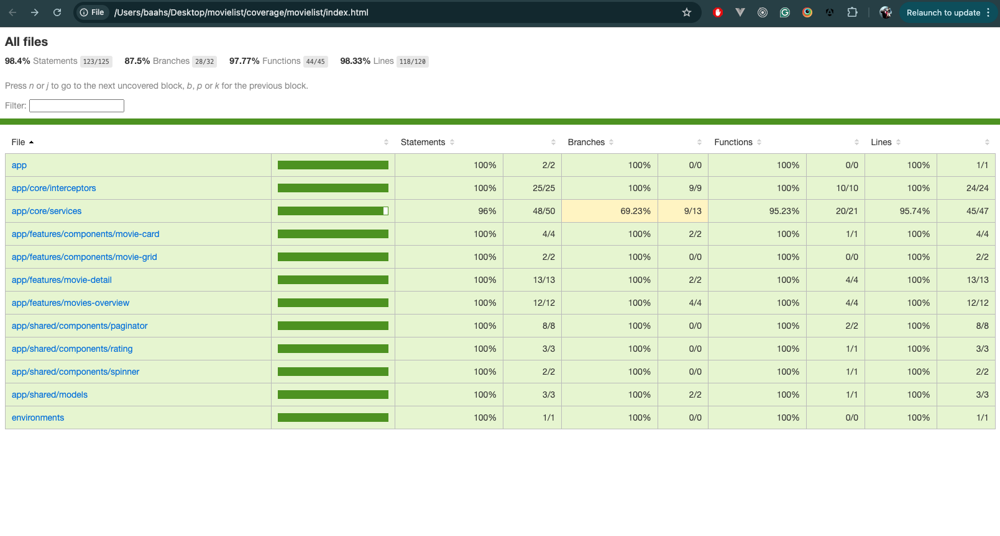
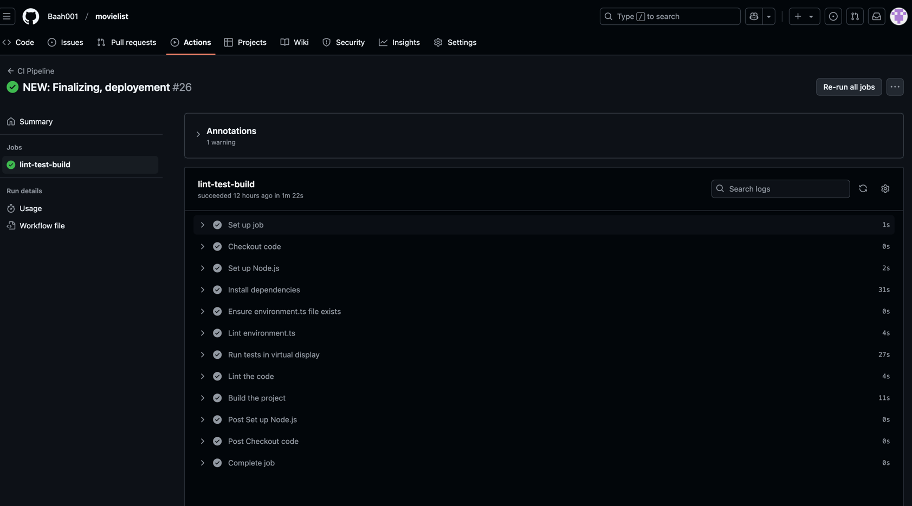
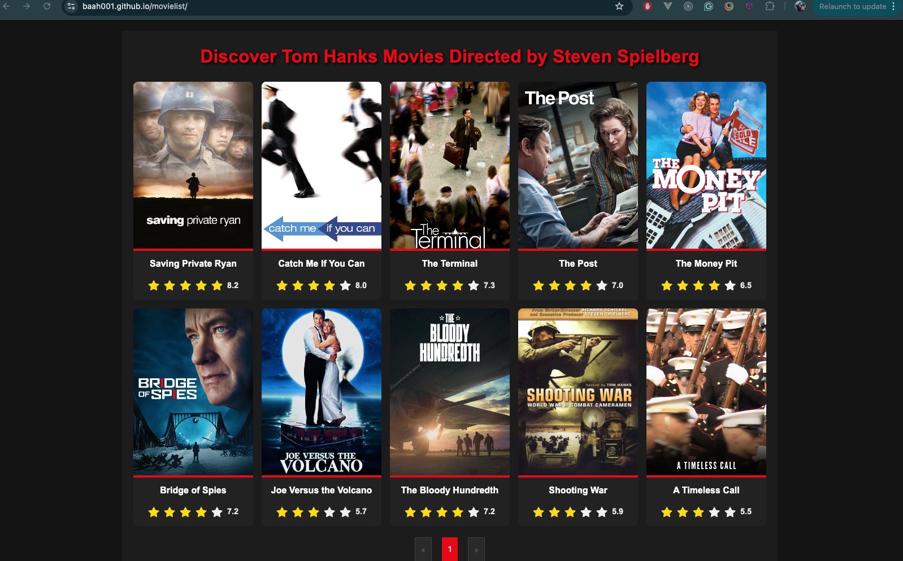

# Movielist

This project was generated using [Angular CLI](https://github.com/angular/angular-cli) version 19.0.7.

This application utilizes the TMDB Discover Movie endpoint with the with_cast and with_crew parameters to fetch movies featuring Tom Hanks and directed by Steven Spielberg.

## Known Issues

- The TMDB API lacks role specificity, so movies may include roles beyond actor and director.
- Placeholder images are used when movie posters are unavailable.

The TMDB API does not allow specifying roles (e.g., actor or director) in the with_cast or with_crew parameters. As a result:

    •	The results may include movies where Tom Hanks or Steven Spielberg participated in a different capacity (e.g., producer, cameo).
    •	To ensure accuracy, further filtering would require fetching movie details (using the Credits endpoint) for each result. However, this would drastically increase the number of API calls, making it unfeasible.

Trade-offs

This approach balances efficiency and scalability, relying on the assumption that the API data is generally accurate for filtering by cast and crew. Some inaccuracies may still occur depending on the data provided by the API.

Future Considerations

    •	Introduce additional filtering logic by querying movie credits where feasible.
    •	Leverage caching or server-side aggregation to optimize API calls for advanced use cases.

## Setting Up the TMDB API Key

1. Register at [TMDB](https://www.themoviedb.org/documentation/api) and get an API key.
2. Copy `src/environments/environment.sample.ts` to:

- `src/environments/environment.ts`
- `src/environments/environment.prod.ts`

3. Replace `your_api_key_here` with your TMDB API key.

**Important:** Never expose your API key in the repository or public files.

### TMDB API Endpoints

- `/search/person` - Fetch actor or director details.
- `/discover/movie` - Fetch movies based on `with_cast` and `with_crew`.
- `/movie/{id}` - Fetch detailed information for a specific movie.

## Development server

To start a local development server, run:

```bash
ng serve
```

Once the server is running, open your browser and navigate to `http://localhost:4200/`. The application will automatically reload whenever you modify any of the source files.

## Code scaffolding

Angular CLI includes powerful code scaffolding tools. To generate a new component, run:

```bash
ng generate component component-name
```

For a complete list of available schematics (such as `components`, `directives`, or `pipes`), run:

```bash
ng generate --help
```

## Building

To build the project run:

```bash
ng build
```

This will compile your project and store the build artifacts in the `dist/` directory. By default, the production build optimizes your application for performance and speed.

## Linting and Code Formatting

This project uses ESLint for linting, with the @angular-eslint plugin to ensure compliance with Angular coding standards.

```angular2html
npm run lint
```

Prettier

Prettier is included for consistent code formatting. You can automatically fix formatting issues by running:

```
npm run prettier-fix
```

Configurations

    •	ESLint: The configuration is specified in .eslintrc or eslint.config.js.
    •	Prettier: The configuration is managed in .prettierrc, ensuring integration with ESLint.

Linting and formatting are integrated into the project to maintain a clean, consistent, and error-free codebase. Developers are encouraged to run these scripts regularly during development.

## Running unit tests

To execute unit tests with the [Karma](https://karma-runner.github.io) test runner, use the following command:

```bash
ng test
```

## Running unit tests with coverage

Run the following command to generate a code coverage report:

```bash
npm run test-coverage
```

The coverage report will be available in the coverage directory. Open coverage/movielist/index.html in your browser to view the detailed report.

    •	Aim for meaningful tests that provide good coverage across components, services, and critical logic.
    •	Focus on edge cases and potential failure points in your application.
    •	Regularly monitor and improve the coverage to ensure application reliability and maintainability.



## Running end-to-end tests

For end-to-end (e2e) testing, run:

```bash
    npm run "cypress:open"
```

The next logical step for enhancing the project would be integrating Cypress end-to-end tests into the GitHub CI pipeline. This process involves configuring Cypress to run as part of your CI workflow. However, this setup requires additional considerations, such as installing Cypress dependencies, configuring the CI environment (e.g., installing a headless browser), and ensuring proper handling of test artifacts (like videos and screenshots).

While this step is crucial for comprehensive testing, it falls outside the current scope.

While the current Cypress tests cover essential user interactions, navigation, and API mocking, the following improvements are identified as out of scope for this assessment but could enhance the testing suite in the future:

    1.	Reusability:
    	Create custom Cypress commands for repeated mock setups and common actions to reduce redundancy.
    2.	Error Handling Tests:
    	Add scenarios for failed API calls and validate the proper display of error messages or fallback states.
    3.	Accessibility Testing:
    	Integrate tools like cypress-axe to ensure the application meets accessibility standards.
    4.	Dynamic and Edge Case Testing:
    	Test with varying datasets, such as movies with missing genres, unusually long titles, or high result counts.
    5.	Visual Regression Testing:
    	Implement visual regression tools to ensure consistent UI appearance across changes.

## Ci Pipeline

This project includes a Continuous Integration (CI) pipeline configured in GitHub Actions to ensure code quality and reliability. The pipeline runs automatically on each push or pull request to the main branch.



## Deployment

To deploy the application to GitHub Pages:

1. Ensure your project builds successfully using .
2. Build for production `npm run build:gh-pages`
3. deploy `npm run deploy:gh-pages`
4. The application will be hosted under the `gh-pages` branch.
5. Visit GitHub Pages link to view the deployed application.

Link to deployed application: https://baah001.github.io/movielist/



## Additional Resources

For more information on using the Angular CLI, including detailed command references, visit the [Angular CLI Overview and Command Reference](https://angular.dev/tools/cli) page.
